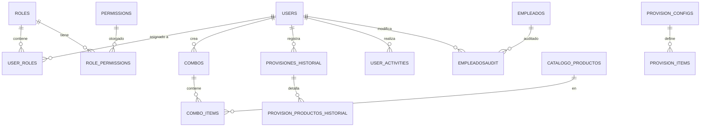

## 1. Diagrama Entidad-Relación (ER) Completo

---

## 2. Diccionario de Datos Detallado

### 2.1 Control de Acceso y Usuarios
- **`users`**: Almacena los datos de acceso, nombre, apellido, alias y estatus de los usuarios del sistema.
- **`roles`**: Define los niveles de acceso (Administrador, Supervisor, etc).
- **`permissions`**: Catálogo de acciones permitidas (e.g., `manage_combos`, `create_provisions`).
- **`user_roles` / `role_permissions`**: Tablas relacionales que vinculan usuarios con roles y roles con permisos.

### 2.2 Gestión de Personal
#### Tabla: `empleados`
| Columna | Tipo | Descripción |
| :--- | :--- | :--- |
| `id` | INT (PK) | ID interno secuencial. |
| `cedula` | INT (Unique) | Cédula de identidad. |
| `nombre` | VARCHAR(100) | Nombres. |
| `apellido` | VARCHAR(100) | Apellidos. |
| `id_empleado` | INT (Unique) | Ficha o ID corporativo. |
| `departamento` | VARCHAR(100) | Departamento de adscripción. |
| `tipoNomina` | INT | 1: Semanal, 2: Quincenal. |
| `boolValidacion` | TINYINT(1) | 1: Activo para provisión, 0: Inactivo. |

### 2.3 Módulo de Combos
- **`combos`**: Cabecera de los paquetes predefinidos de productos.
- **`combo_items`**: Detalle del combo (Producto + Cantidad). Se relaciona con `catalogo_productos`.

### 2.4 Módulo de Provisiones
#### Tabla: `catalogo_productos`
| Columna | Tipo | Descripción |
| :--- | :--- | :--- |
| `id` | INT (PK) | Identificador. |
| `nombre` | VARCHAR(100) | Nombre del rubro. |
| `categoria` | VARCHAR(50) | Categoría (Víveres, Proteína, etc). |
| `unidad` | VARCHAR(20) | Unidad de medida (Kg, Unid, etc). |

- **`provision_configs` / `provision_items`**: Configuración estacional de productos.
- **`provisiones_historial`**: Registro maestro de cada proceso de entrega realizado.
- **`provision_productos_historial`**: Desglose producto por producto de cada provisión histórica.

---

## 3. Auditoría y Logs
- **`user_activities`**: Log de eventos de sistema (Inicios de sesión, acciones críticas).
- **`empleadosaudit`**: Historial de cambios realizados en la ficha de los empleados (Valor anterior vs Valor nuevo).
- **`v_resumen_auditoria`**: Vista simplificada que agrupa auditoría por empleado.

---

## 4. Scripts de Mantenimiento
- **`init_database.py`**: Fuente única de verdad para la creación de tablas.
- **`config/database.py`**: Gestor de conexiones y pool de base de datos.
- **`scripts/cleanup_database.py`**: Herramienta de migración y limpieza de tablas obsoletas.
---

## 6. Reporte de Uso de Tablas (Esquema Actualizado)

A continuación se detalla la función principal y el módulo de control para cada tabla activa en el sistema:

| Tabla | Propósito Principal | Módulo / Controlador |
| :--- | :--- | :--- |
| **`users`** | Gestión de cuentas de usuario y credenciales. | `controllers/auth.py` |
| **`roles` / `permissions`** | Definición de niveles de acceso y acciones permitidas. | `controllers/roles.py` |
| **`user_roles`** | Vinculación N:M entre usuarios y sus roles asignados. | `controllers/roles.py` |
| **`empleados`** | Registro maestro de la nómina (Cédulas, Nombres, Estatus). | `controllers/employees.py` |
| **`catalogo_productos`**| Maestro de rubros disponibles (Víveres, Proteína, etc). | `controllers/products.py` |
| **`combos`** | Cabecera de paquetes predefinidos para provisión local. | `controllers/combos.py` |
| **`combo_items`** | Detalle de rubros individuales dentro de cada combo. | `controllers/combos.py` |
| **`provision_configs`** | Configuración de la provisión actual por periodo. | `controllers/provision.py` |
| **`provision_items`** | Rubros asignados por defecto según el periodo. | `controllers/provision.py` |
| **`provisiones_historial`**| Registro histórico de provisiones ejecutadas. | `controllers/history.py` |
| **`provision_productos_historial`**| Auditoría granular de rubros entregados históricamente. | `controllers/history.py` |
| **`user_activities`** | Log de actividades de usuario (Logins, Logs de acceso). | `controllers/admin.py` |
| **`empleadosaudit`** | Historial de auditoría técnica por cada cambio en empleados. | Triggers DB / `controllers/admin.py` |

---

**Nota Técnica:** Todas las tablas utilizan el motor **InnoDB** y codificación **utf8mb4_bin** para garantizar la integridad de los datos y el soporte total de caracteres.
