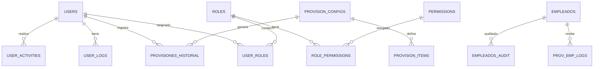

# Documentación Técnica de la Base de Datos: Lider Pollo

Esta documentación proporciona una visión técnica profunda del esquema, relaciones y lógica almacenada de la base de datos del proyecto.

## 1. Diagrama Entidad-Relación (ER)

---

## 2. Diccionario de Datos

### Tabla: `users`

Almacena las credenciales y datos básicos de los usuarios del sistema.
| Columna | Tipo | Descripción |
| :--- | :--- | :--- |
| `id` | INT (PK) | Identificador único autoincremental. |
| `username` | VARCHAR(100) | Nombre de usuario (único). |
| `email` | VARCHAR(255) | Correo electrónico. |
| `password` | VARCHAR(255) | Hash de la contraseña (PBKDF2). |
| `isAdmin` | TINYINT(1) | Flag para superusuario (0=No, 1=Sí). |
| `name` | VARCHAR(100) | Nombre real del usuario. |

### Tabla: `empleados`

Contiene la información del personal que recibe provisiones.
| Columna | Tipo | Descripción |
| :--- | :--- | :--- |
| `id` | INT (PK) | Identificador interno. |
| `id_empleado` | INT | ID externo (Reloj checador/Nómina). |
| `cedula` | INT | Documento de identidad (Único con id_empleado). |
| `nombre` | VARCHAR(50) | Nombres del empleado. |
| `apellido` | VARCHAR(50) | Apellidos del empleado. |
| `departamento` | VARCHAR(50) | Área donde labora. |
| `tipoNomina` | INT | Categoría de nómina (1=Semanal, 2=Quincenal, etc.). |
| `boolValidacion` | INT(1) | Estado de validación administrativa. |

### Tabla: `provisiones_historial`

Registro histórico de los ciclos de entrega ejecutados.
| Columna | Tipo | Descripción |
| :--- | :--- | :--- |
| `id` | INT (PK) | ID del registro. |
| `tipo_provision` | VARCHAR(20) | Tipo (Semanal/Quincenal). |
| `semana` | INT | Número de semana del año. |
| `productos` | TEXT | Listado JSON de productos entregados. |
| `usuario_id` | INT (FK) | Usuario que ejecutó la provisión. |

---

## 3. Lógica Almacenada: Triggers y Vistas

### Triggers

- **`before_empleado_update`**: Se dispara antes de cualquier actualización en la tabla `empleados`.
  - **Función**: Compara valores antiguos y nuevos (`cedula`, `nombre`, `apellido`). Si hay cambios, inserta un registro en `empleados_audit`.

### Vistas (Views)

- **`v_proximos_cumpleanos`**:
  - Consulta empleados cuya fecha de nacimiento esté dentro de los próximos 7 días.
  - Útil para el sistema de notificaciones automáticas.
- **`v_resumen_auditoria`**:
  - Agrupa los cambios por empleado, mostrando el total de ediciones y la fecha de la última modificación.

---

## 4. Scripts de Base de Datos

| Script         | Ubicación              | Función                                                       |
| :------------- | :--------------------- | :------------------------------------------------------------ |
| Inicialización | `config/database.py`   | Crea las tablas base y el usuario admin inicial.              |
| Avanzado       | `setup_advanced_db.py` | Crea las **Vistas** y Foreign Keys con CASCADE.               |
| Auditoría      | `setup_triggers.py`    | Crea la tabla de auditoría y el **Trigger** de actualización. |
| Mantenimiento  | `manage_db.py`         | Utilidad para resetear o migrar datos.                        |

---

## 5. Auditoría y Logs

El sistema mantiene tres niveles de logs:

1. **`user_logs`**: Inicios de sesión y accesos.
2. **`user_activities`**: Acciones CRUD dentro del sistema (qué usuario hizo qué).
3. **`empleados_audit`**: Cambios históricos en los datos maestros del personal.
